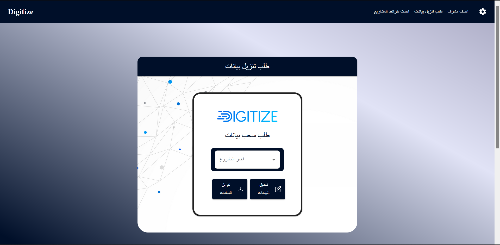
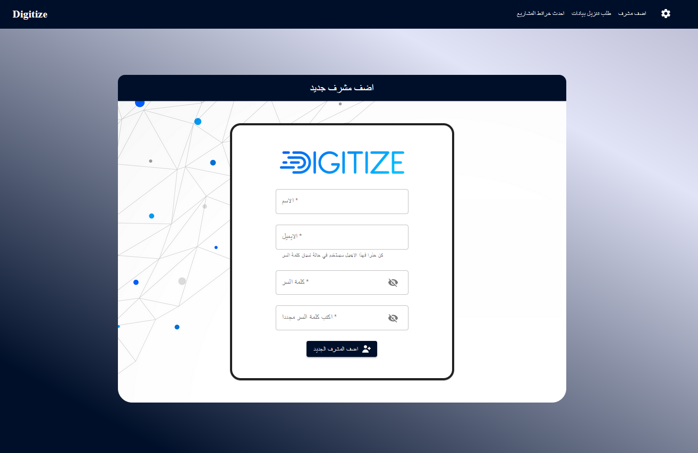
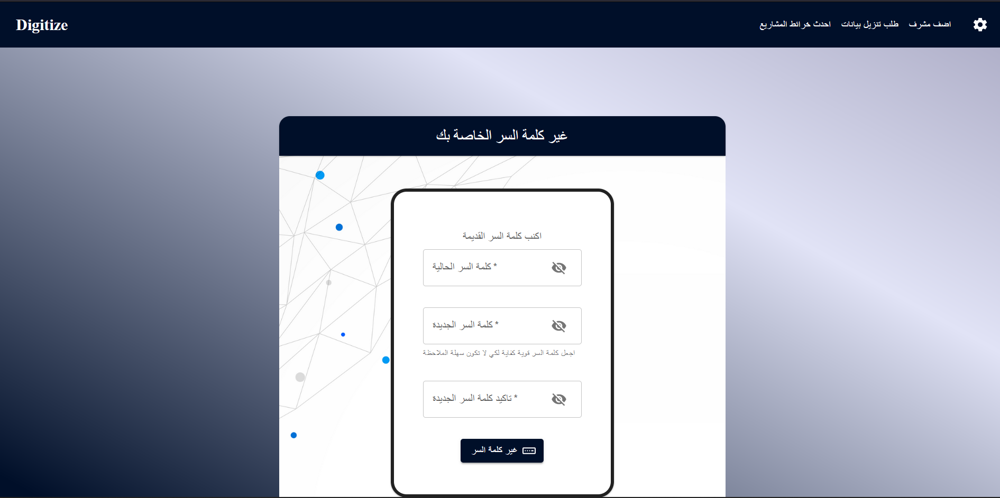
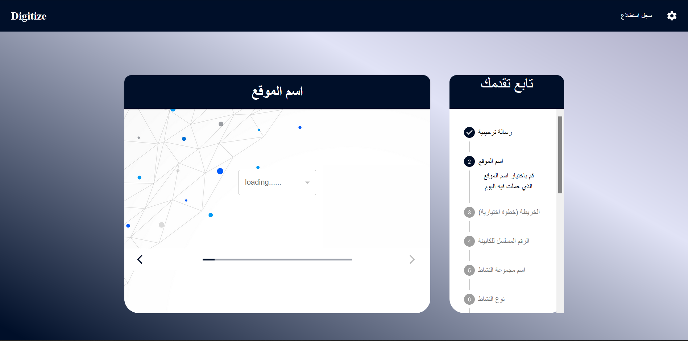
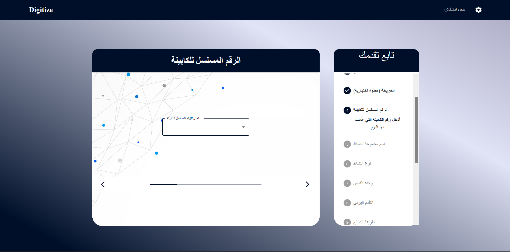
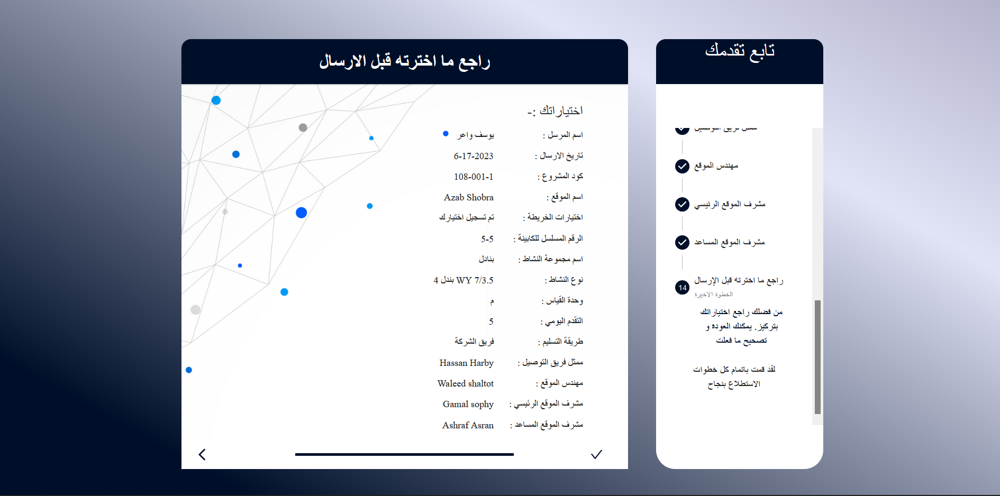
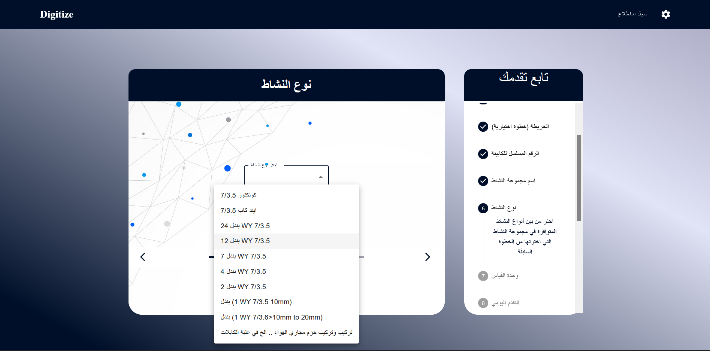
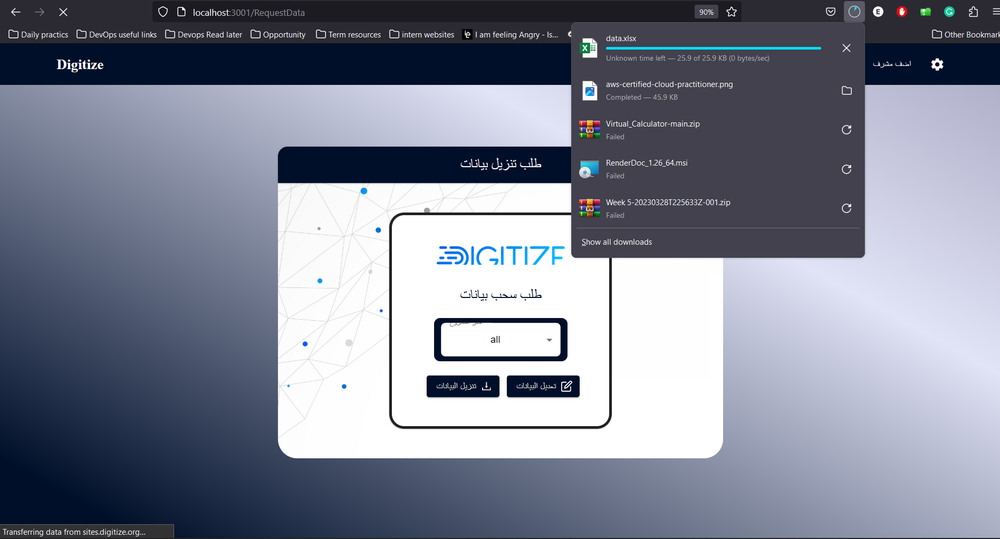

# Digitize

<h2>Table of Contents</h2>
<ul>
  <li><a href="#built-with--">Built With</a></li>
  <li><a href="#getting-started">Getting Started</a></li>
  <li><a href="#Description">Description</a></li>
  <li><a href="#Documentation">Documentation</a></li>
  <li><a href="#Screenshots">Screenshots</a></li>
  <li><a href="#Contributors">Contributors</a></li>
</ul>

<h2 href="#BuiltWith">Built With : </h2>
 <ul>
  <li><a href="https://www.w3schools.com/nodejs/">Node js</a></li>
  <li><a href="https://www.javatpoint.com/expressjs-tutorial">Express js</a></li>
  <li><a href="https://www.w3schools.in/mongodb/tutorials/">MongoDB</a></li>
  <li><a href="http://www.w3schools.me/aspnetcore/implement-jwt">JSON Web Token</a></li>
  <li><a href="https://www.w3schools.com/REACT/DEFAULT.ASP">React js</a></li>
  <li><a href="https://redux.js.org/">Redux</a></li>
  <li><a href="https://mui.com/material-ui/getting-started/templates/">Material UI</a></li>
 </ul>

<h2 href="#GettingStarted">Getting Started</h2>
<blockquote>
  
This is a list of needed instructions to set up your project locally, to get a local copy up and running follow these instructions.
 

</blockquote>
<ol>
<li>
  <h4>Clone the repository.</h4>
 </li>
 <li>
  <h4>cd into backend folder and create a file named "config.env" and fill it with this fields with your information. <h4>    <blockquote><code> 
 NODE_ENV=development  
PORT=[PORT YOU WANT]  
DATABASE=[CONNECTION STRING OF YOUR DATABASE]  
USER=[DATABASE USER NAME]  
DATABASE_PASSWORD=[YOUR DATABASE PASSWORD]  
JWT_SECRET=[YOUR JWT SECRET STRING]  
JWT_EXPIRES_IN=[DATE example: 1d "for one day"]  
JWT_COOKIE_EXPIRES_IN=[Date example: 1 "for one day"]  
FILEPATH=https://sites.digitize.org/api # For returning photos in rows data  
EMAIL_USERNAME=[EMAIL USERNAME TO SEND MAILS]  
EMAIL_PASSWORD=[YOUR EMAIL APP PASSWORD]  
EMAIL_FROM=[EMAIL USERNAME TO SEND MAILS]  

 </code></blockquote>
 </li>
 <li>
  <h4>Follow this article to install node js and npm <a href="https://phoenixnap.com/kb/install-node-js-npm-on-windows">Install Node js and npm</a></h4>
 </li>
 <li>
  <h4><code>cd backend && npm i && npm start</code></h4>
 </li>
 <li>
  <h4><code>cd .. && cd frontend && npm i && npm start</code></h4>
 </li>
 </ol>

<h2 href="#Description">Description</h2>
  

  This project was made for <a href="https://digitize.org/">Digitize</a> company.
   
   
Website is in Arabic Language.
 
 
It is a website that has 2 kinds  of users: 
<ol>
<li>Supervisor, </li>
<li>Website Admin.</li>
</ol>
 Each user has different pages to view. 
  
 <strong>First: Supervisor:</strong>
  
<ol>
<li>First, he logs in with his email and password that the website admin gave it to him.</li>
<li>He can go to the default URL of the  website to submit a survey in which he enters the data in multi steps sequence.</li>  
Required  data:  
<ol>
<li>Choose a Project Code.</li>
<li>Choose a Site Name from list of site names of this project.</li>
<li>Manually enter a Capinet Serial.</li>
<li>Choose an Activity Group Name. </li>
<li>Day Progress & select many squares from project map to mark  them as complete or attach a photo.</li> 
<li>Choose a Delivery Way.</li>
<li>Choose a Delivery Team Name.</li>
<li>Choose a Site Engineer.</li>
<li>Choose a Site Supervisor (Main).</li>
<li>Choose a Site Supervisor  (Assistant).</li></ol></li>
</ol>

<strong>Second: Website  Admin:</strong>
 

<ol> 
<li>First, he logs in with his email and password, and will be authorized as an admin, so he can see a different page.</li>
<li>He can ask for data, he can  export and download all data that the supervisors added  as an  excel file,  or select a certain project to just  export the data of this project.</li>
<li>
He can have another tab to create a supervisor account, he enters a new  name, email, and password for the new supervisor, then submits and gives  these information to the supervisor.</li>
<li>
He have another  tabs for:
<ol>
<li>Create/  Delete project/s.</li>
<li>Create/  Delete site  name/s of a  certain project.</li>
<li>Create/  Delete activity group/s.</li>
<li>Create/  Delete activity type/s. </li>
<li>Create/  Delete site  engineer/s.</li>
<li>Create/  Delete site  supervisor  (main).</li>
<li>Create/  Delete site  supervisor  (assistant).</li>
<li>Create/  Delete delivery way/s.</li>
<li>Create/  Delete delivery team/s.</li>
<li>Upload a project map. </li>
</ol>
</li>
</ol>
 

<h2 href="#Documentation">Documentation</h2>
  

  You can look on the API documentation at <a href="https://documenter.getpostman.com/view/22736405/2s93mAVL7z">API Documentation</a>
  

<h2 href="#Screenshots">Screenshots</h2>
<ol>
    <li>
    
    </li>
    <li>
    
    </li>
    <li>
    
    </li>
    <li>
    
    </li>
    <li>
    
    </li>
    <li>
    
    </li>
    <li>
    
    </li>
    <li>
    
    </li>
    <li>
    
    </li>
    <li>
    
    </li>
    <li>
    
    </li>
    <li>
    
    </li>
    <li>
    
    </li>
    <li>
    
    </li>
    <li>
    
    </li>
    <li>
    
    </li>
    <li>
    
    </li>
    <li>
    
    </li>
    <li>
    
    </li>
    <li>
    
    </li>
    <li>
    
    </li>
    <li>
    
    </li>
    <li>
    
    </li>
    <li>
    
    </li>
    <li>
    
    </li>
</ol>

<h2 href="#Contributors">Contributors</h2>
<h3>Frontend & DevOps</h3>
<table> 
  <tbody>
    <tr>
      <td align="center">
        
         
        <a href="https://github.com/Waer1">Yousef Khaled</a>
      </td>
    </tr>
  </tbody>
</table>
<h3>Backend</h3>
<table> 
  <tbody>
    <tr>
      <td align="center">
        
         
        <a href="https://github.com/MoazHassan2022">Moaz Mohammed</a>
      </td>
    </tr>
  </tbody>
</table>
